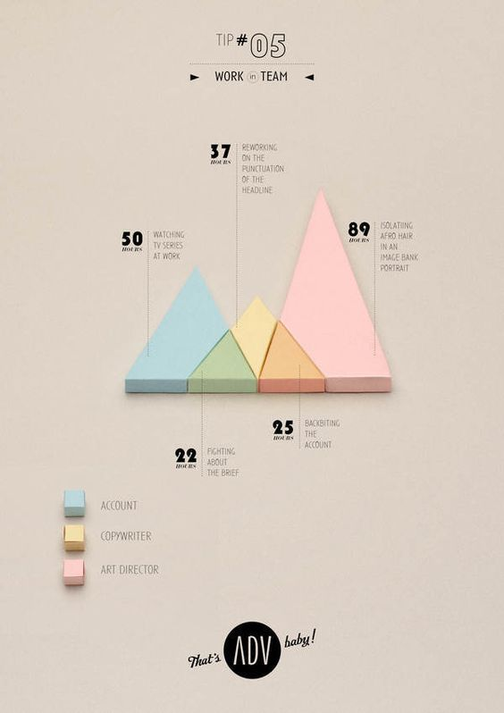
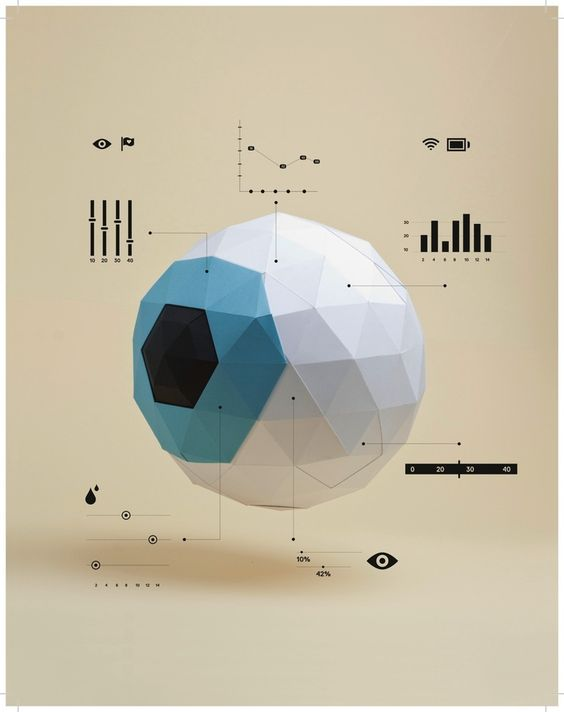

# How is your neighbour? 

## Idea

Create a website that uses an infographic in the form of a map of Germany to show how people in Germany currently feel. People should explain with only one word how they feel at the moment. The top 10 answers of Germany should be listed, but also the top answers of all federal states. In this way, a comparison can be made between the federal states. The top results are recorded and reloaded weekly (so they are saved over a weekly interval) and then saved in a timeline. So at the end of the year there is an overview of when people were doing how. So the website should have the following **main functions**:

* **INPUT:** An input field for saving the feeling of each user. Here should be an own input, but also between several can be selected.
* **INPUT:** An input field (or automatic localization) for the federal state, in which one lives - here one should select one and not enter it, in order to avoid spelling mistakes.
* **UI:** An interactive map of Germany to view and select the top results. 
* **UI:** An interactive timeline to watch the development of the top results.  
* **DATABASE:** A database where all results are stored. 

## Design 

The design is supposed to be a mix between 2D and 3D. The map should be a low-poly 3D Model made with p5 and WEBGL.

